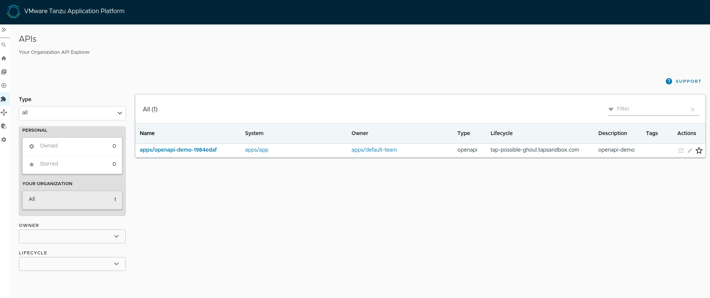
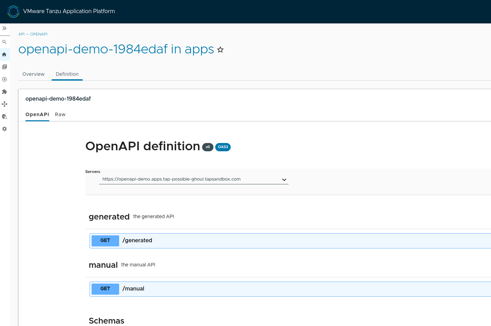

# Spring Boot and OpenAPI

The `/manual` endpoint is defined in `MyEndpoint`:

```java
@RestController
@RequestMapping("/manual")
@Tag(name = "manual", description = "the manual API")
public class MyEndpoint {
	@GetMapping(produces = "application/json")
	@Operation
	public Model message() {
		Model hello = new Model();
		hello.setName("Hello");
		return hello;
	}
}
```

The `openapi.yaml` was generated from that endpoint using the [Small Rye Maven plugin](https://github.com/smallrye/smallrye-open-api) (without the Springdoc dependency, so only the application endpoint is detected). Then it was edited to change the path to `/generated` and that endpoint was generated by the [OpenAPI Generator](https://openapi-generator.tech) project.

When Springdoc is on the classpath:

```xml
<dependency>
  <groupId>org.springdoc</groupId>
  <artifactId>springdoc-openapi-starter-webmvc-api</artifactId>
  <version>2.0.2</version>
</dependency>
```

you can view the OpenAPI v3 specification including the generated endpoint at:

```
http://localhost:8080/v3/api-docs
```

The Swagger UI is served from hhttp://localhost:8080/swagger-ui/index.html if you add the Swagger UI dependency (`springdoc-openapi-starter-webmvc-ui` instead of `*-api`). You can always use an external Swagger UI, like a browser extension or an IDE plugin, to view and interact with the OpenAPI spec even if the UI is not served directly from the app.

Note that if you have configured the `host` to be something other than localhost, the calls through swagger-ui will be directed to that host and not localhost!

OpenAPI specs can also be generated using the [Spring Docs Plugin](https://springdoc.org/plugins.html) during integration testing (`mvn verify`). The `openapi.json` shows up in `target` directory, and includes all the Spring endpoints (`/manual` and `/generated`). It's only a download of the `/v3/api-docs` endpoint, so it doesn't actually generate the JSON from the code.

The app compiles to a native image and all the JSON endpoints work, including the OpenAPI specification. The Swagger UI does not work.

## Tanzu Application Platform

Aside from the fact that Kubernetes itself is built from and exposes an OpenAPI spec, TAP itself has a few OpenAPI-related features.

### TAP GUI Catalog

The second is the ability to add an OpenAPI spec for your app to the TAP GUI Catalog. You can do it manually using the GUI and some YAML, or using the underlying Backstage API. A better (and more Tanzu-specific) approach is to create an API Descriptor for your app and push it into Kubernetes as a custom resource. Example:

```yaml
apiVersion: apis.apps.tanzu.vmware.com/v1alpha1
kind: APIDescriptor
metadata:
  labels:
    apis.apps.tanzu.vmware.com/register-api: "true"
    app.kubernetes.io/part-of: app
  name: c
spec:
  description: myapp
  location:
    baseURL:
      url: https://myapp.tap-choice-bluebird.tapsandbox.com
    path: /v3/api-docs
  owner: default-team
  system: app
  type: openapi
```

Then it shows up in the TAP GUI Catalog:



clicking on the API Descriptor shows the Swagger UI:



You can't try it out in the UI unless you have CORS configuration set up for your app. You could do taht with a gateway, or you could just use Spring to add the CORS headers in the app:

```java
@Bean
public CorsFilter corsFilter() {
	UrlBasedCorsConfigurationSource source = new UrlBasedCorsConfigurationSource();

	// Allow anyone and anything access.
	CorsConfiguration config = new CorsConfiguration();
	config.setAllowCredentials(true);
	config.addAllowedOriginPattern("*");
	config.addAllowedHeader("*");
	config.addAllowedMethod("*");

	source.registerCorsConfiguration("/**", config);
	return new CorsFilter(source);
}
```

You can also use the Tanzu Supply Chain to generate the API Descriptor from the OpenAPI spec. Just add a parameter to your workload:

```yaml
apiVersion: carto.run/v1alpha1
kind: Workload
...
spec:
...
  params:
  - name: api_descriptor
    value:
      type: openapi
      location:
        path: "/v3/api-docs"
      owner: default-team
      system: app
      description: "openapi-demo"
```

### Spring Cloud Gateway

The Spring Cloud Gateway for TAP is a Kubernetes operator that allows you to configure a Spring Cloud Gateway instance to route traffic to your apps. It also allows you to configure the gateway to expose an OpenAPI spec for your app. The spec is generated from the route defintions in the gateway.

### API Portal

The API Portal is a UI that allows you to browse the OpenAPI specs for all the apps in your TAP instance. If your TAP instance has it, you might find it as a Contour proxy:

```
$ kubectl get httpproxies -A
NAMESPACE        NAME                     FQDN                                               TLS SECRET            STATUS   STATUS DESCRIPTION
api-portal       api-portal               api-portal.tap-possible-ghoul.tapsandbox.com       api-portal-tls-cert   valid    Valid HTTPProxy
...
```

This one is exposed at https://api-portal.tap-possible-ghoul.tapsandbox.com. You can log in with your TAP credentials and then browse the OpenAPI specs for all the apps in your TAP instance.
